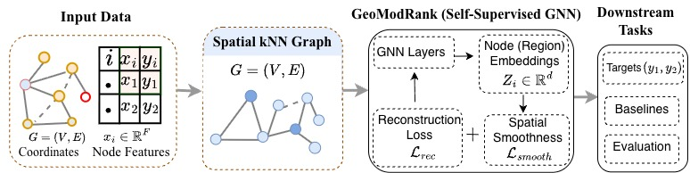

# AI for Healthy Climate Adaptation — Synthetic Geospatial SSL (Harvard PostDoc)


This repository implements a spatially-aware self-supervised learning framework for synthetic geospatial data, integrating spatial graph structure with multimodal masked reconstruction to learn region-level representations under strict deterministic controls for full reproducibility.

This is developed as my submission for the `homework task` associated with the `Postdoctoral` Research Position in AI for Healthy Climate Adaptation.

## GeoModRank Framework Overview



*Figure 1: End-to-end pipeline for deterministic synthetic geospatial data generation, spatial kNN graph construction, self-supervised training (GeoModRank), embedding extraction, and downstream interpolation evaluation.*

The framework implements a fully reproducible, end-to-end pipeline that:

1. Generates a deterministic synthetic geospatial dataset  
2. Constructs a spatial kNN graph over regions  
3. Trains a spatially-aware self-supervised model (GeoModRank)  
4. Extracts region-level embeddings  
5. Evaluates embeddings on a downstream spatial interpolation task  

All results reported in `report.pdf` are reproducible from this repository using the commands below.


## Quick Reproduction (End-to-End)

From a clean clone:

```bash
git clone <repo>
cd healthy-climate-ssl

conda create -n harvard_postdoc python=3.10
conda activate harvard_postdoc
pip install -r requirements.txt

chmod +x run_all.sh
./run_all.sh
```

This script runs the full pipeline: validation tests, dataset generation, spatial kNN graph construction, self-supervised training (GeoModRank), embedding export, and downstream interpolation.

All outputs are written to:

```
data/v1_seed7/
```
All experiments are fully deterministic under seed **7**.


---

### Environment Setup

```bash
conda create -n harvard_postdoc python=3.10
conda activate harvard_postdoc
pip install -r requirements.txt
```

Python: **3.10**  
Frameworks: **PyTorch**, **PyTorch Geometric**
Hardware: Experiments were conducted on a CPU-only machine (8-core, 8GB RAM). No GPU acceleration was used.
---


### Implementation Summary

The pipeline consists of:

1. A deterministic synthetic geospatial dataset with multimodal region-level features  
2. A spatially-aware self-supervised model trained via masked reconstruction  
3. Extraction of 192-dimensional region embeddings  
4. A standardized 70/10/20 region-level interpolation split  
5. Evaluation using simple downstream predictors (Ridge / MLP) compared to coordinate-based baselines  (Mean, IDW, KNN, NWKR)  a

All randomness is explicitly seeded, and validation tests (`pytest`) are included to verify schema integrity, training stability, and embedding export.

---

### Deliverables

This repository includes:

- Complete implementation  
- Validation tests  
- End-to-end runnable pipeline  
- `report.pdf` (3 page research note)  

---
### AI Assistance Disclosure

AI-based tools (large language models) were used for structural refinement, documentation refinement, and minor code refactoring.

All modeling logic, mathematical formulation, dataset generation, and evaluation procedures were independently implemented, executed, and verified. The author assumes full responsibility for correctness and reproducibility.
